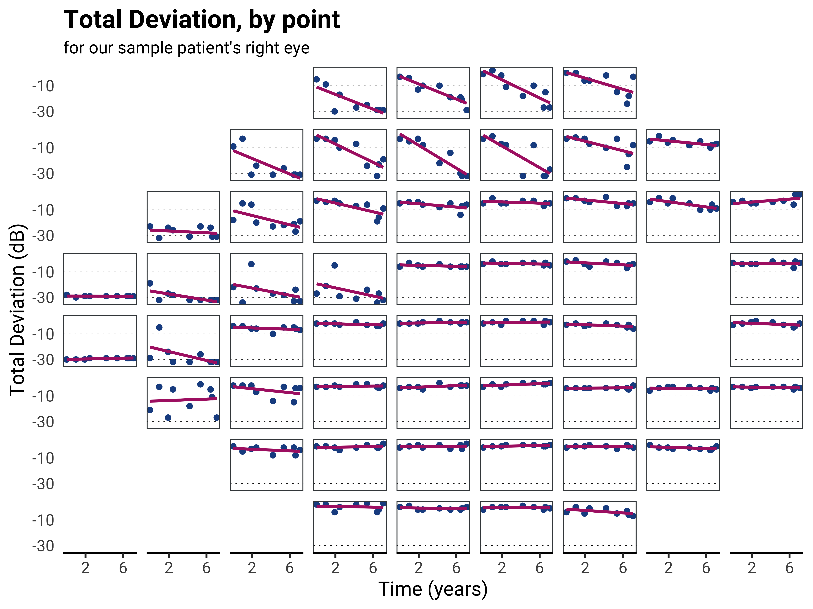

# NB Plots

This is a collection of miscellaneous helper functions for my plots.

The code in this repository was used to create the plots for my 2018 AAO presentation.

Navigate to the `R` folder to see the code.

## Generating a 24-2 plot

Likely the most useful code in this package is the function which makes it easier to create this:




### Background
This is currently a two step process:

1. Left join to VF map and create plot facetted by VF location
2. Convert to a grob object then remove the empty locations

1 and 2 are done automatically using the `add_vf_locations()` and `vf_plot` functions.

*Note* that it would be more convenient for this to be a one-step process, e.g. where the user could simply call `vf_plot` in a similar manner to `ggplot`.

The problem with this approach is that converting back from a grob to a ggplot is not trivial, even with helper functinos such as `ggplotify::as.ggplot` (in my testing this does not allow for appropriate manipulation of the labels, scale, etc. as with a true ggplot). If you have suggestions for improvement, please feel free to let me know.

### Operation

```{r}
# Load package
library(nbplots)

# Load data
to_plot <- grn[ideye == "chosen_eye", .(ideye, x, y, totaldev, time)]

# Add vf locations
to_plot <- add_vf_locations(to_plot)

# Plot, making sure to facet_wrap by location and with 8 rows
p <- ggplot(to_plot, aes(time, totaldev))
p <- p + geom_point()
p <- p + facet_wrap(. ~ location, nrow = 8)

# Remove empty locations  
g <- vf_plot(p)
```

Now to output this plot you can either:

```{r}
# Save plot
ggsave(filename = "my_plot.png",
       plot = g,
       path = "path/to/file")
       
# Or you can display the plot
library(grid)
grid.newpage()
grid.draw(g)
```

As noted above, if you want to adjust any aspects of the plot, do this before the second step, e.g. 

```{r}
# Plot, making sure to facet_wrap by location and with 8 rows
p <- ggplot(to_plot, aes(time, totaldev))
p <- p + geom_point(color = "darkblue")
p <- p + labs(title = "My outstanding 24-2 plot")
p <- p + facet_wrap(. ~ location, nrow = 8)
```
